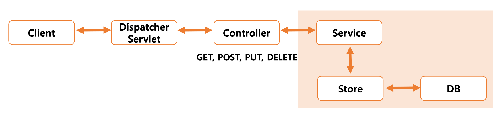
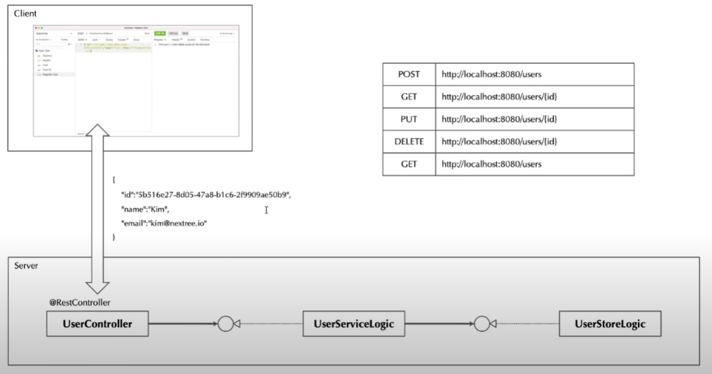
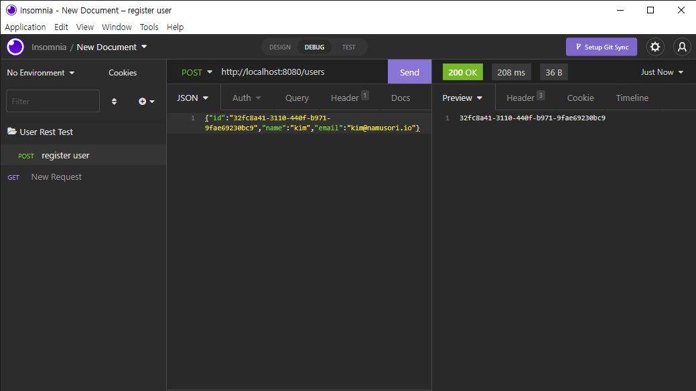

# Web Service의 이해

> HTTP는 REST(Representional State Transfer) 개념을 바탕으로 설계하였다.
 
<br>

# RESTful 아키텍처 스타일
- 모든 리소스는 URI로 식별한다. (URI: 어느 위치에 어떤 자료까지 포함하는 데이터)
- 모든 리소스는 다중 표현을 가질 수 있다.
- 모든 리소스는 표준 HTTP 메소드로 접근/변경/생성/삭제(POST, GET, PUT, DELETE) 할 수 있다.
- 서버는 상태 정보를 갖지 않는다.

> RESTful API를 설계한다는 것은 사용자에게 제공하고자 하는 리소스에 대한 접근을 명확하고 쉽게 만든다는 의미이다.

<br>

# RESTful API Naming

| Resource       | POST(create)   | GET(read)     | PUT(update)          | DELETE(delete) |
|----------------|----------------|---------------|----------------------|----------------|
| /articles      | 새로운 article 생성 | article 목록    | articles에 대한 대량 업데이트 | 모든 articles 삭제 |
| /articles/1234 | 에러             | 특정 article 보기 | 있으면 업데이트 없으면 에러      | 삭제             |

<br>

## Spring MVC의 구조
- Spring MVC는 프론트 컨트롤러 패턴을 기초로한 아키텍처를 가진다.
- DispatcherServlet은 Spring MVC의 핵심으로써 프론트 컨트롤러 역할을 담당한다.
- client ⇄ DispatcherServlet ⇄ HandlerMapping (@GetMapping, @PostMapping) → Constroller



<br>

# RESTful Service 구현하기

## User라는 도메인에서 CRUD를 구성해보는 예제

| Method | URL                               |
|--------|-----------------------------------|
| POST   | http://localhost:8080/users       |
| GET    | http://localhost:8080/user/{id}   |
| PUT    | http://localhost:8080/user/{id}   |
| DELETE | http://localhost:8080/user/{id}   |
| GET    | http://localhost:8080/users       |

<br>

## Server
UserController ⇄ UserServiceLogic ⇄ UserStoreLogic



<br>

## pom.xml
1. spring initializer를 이용해서 작성
    - Dependencies: springweb, lombok
2. [maven repository](https://mvnrepository.com/) 에서 gson 라이브러리 추가
   - Dependencies: gson

<br>

## main 디렉터리 구조
- io.namusori.rest
  - entity
    - User.java
  - service
    - logic
      - UserServiceLogic.java
    - UserService.java (Interface)
  - store
    - logic
      - UserStoreLogic.java
    - UserStore.java (Interface)
  - controller
    - UserController.java
  - UserRestApp.java

### UserRestApp.java
서버 실행 소스
- @SpringBootApplication
```java
import org.springframework.boot.SpringApplication;
import org.springframework.boot.autoconfigure.SpringBootApplication;

@SpringBootApplication
public class UserRestApp {
    public static void main(String[] args) {
        SpringApplication.run(UserRestApp.class, args);
    }
}
```

### entity/User.java
- @Getter
- @Setter
- @ToString
- new Gson().toJson(user)

### store/logic/UserStoreLogic.java
- @Repository

### service/logic/UserServiceLogic.java
- @Service

### UserController.java
사용자 요청을 DispatcherServlet이 받아서 userController로 해당 요청을 위임하고 그에대한 처리를 함.

- @RestController : json으로 통신할 수 있도록 도와주는 라이브러리
- @RequiredArgsConstructor

#### POST http://localhost:8080/users
- @PostMapping("/users")
- @RequestBody

#### GET http://localhost:8080/user/{id}
- @GetMapping("/user/{id}")
- @PathVariable

#### GET http://localhost:8080/users
- @GetMapping("/users")

<br>

## DI 적용 방법 (의존성 주입)
1. @RequiredArgsConstructor
2. @AutoWired
3. 생성자

<br>

# Junit5기반 단위테스트

## test 디렉터리 구조
- io.namusori.rest
  - service
    - logic
      - UserServiceLogicTest.java

### service/logic/UserServiceLogicTest.java
- @SpringBootTest
- @BeforeEach : 테스트를 위한 데이터 세팅
- @Autowired
  > 단위테스트 시 DI 적용 방법은 `@Autowired` 를 사용해야 한다.
- @Test : 단위 테스트
- @AfterEach : 테스트 이후 데이터 초기화

<br>

# Insomnia 테스트

