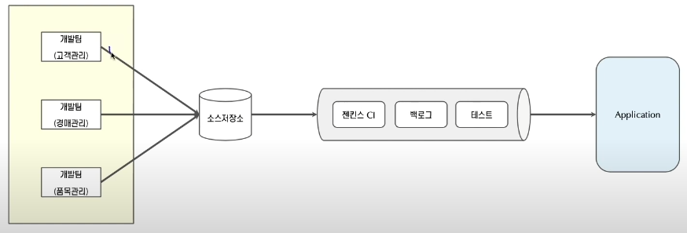
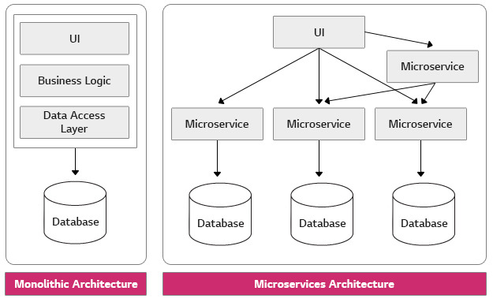
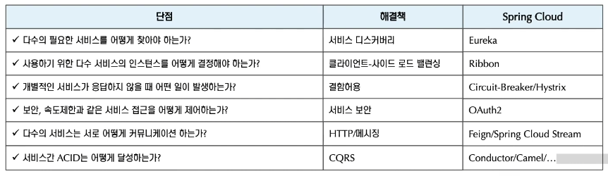

# 3.1 모놀리스 아키텍처 (Monolith)
: 모든 업무 로직을 하나의 애플리케이션 형태로 묶어 서비스하는 형태
- 구성: 사용자 인터페이스 + 서버 + 데이터베이스

## 단점
- 규모가 커질수록 기능을 추가하거나 수정하는 것이 큰 비용을 초래한다.

 

# 3.2 마이크로서비스 아키텍처 (MSA)
: 서버가 여러개로 구성돼 각기 다른 서비스가 별도 운영된다. 서비스별로 저장소도 분리되어있다. 

## 장점
- 확장 시 기능별 독립적 확장 가능하다.
- 기술에 대한 다양성(polyglot)을 가질 수 있다. (서로 다른 언어로 개발이 가능)
- 각 서비스는 서로 다른 팀이 개발,운영 가능하다.
- 전체 시스템의 다운을 방지할 수 있다.

## 단점
- 분산 환경이라 디버깅과 추적이 어렵다.
- 애플리케이션 개발과 배포방법 (CI/CD)가 중요해진다.
- 서비스간 호출에 따른 커뮤니케이션 비용이 증가한다.

## API GateWay (Edge 서버) 에 접근할 수 있는 도구
- Zuul 1.0
- Spring Cloud Gateway

 

# 3.3 Spring Cloud
: Spring Boot 기반의 마이크로서비스 구축에 필요한 라이브러리들의 집합
- cloud-native 패턴 중 몇가지에 집중한다.
- 다수의 서브 프로젝트가 있다.
- 마이크로서비스의 단점을 해결하기 위한 다양한 기술이 있다.
 

### 사용해 볼 기술들
- Eureka
- Ribbon
- Hystrix
- Feign

 

# 3.4 Spring Cloud config
: 분산되어 있는 여러 서비스의 설정을 관리할 수 있는 서버와 클라이언트를 제공한다.
- 마이크로서비스가 시작할 떄 Spring Cloud Config에서 관리하는 설정 정보를 요청한다.
- 환경별로 설정을 분리할 수 있다.
- 환경에 따른 설정 정보는 profile과 labe로 구분 가능하다.

